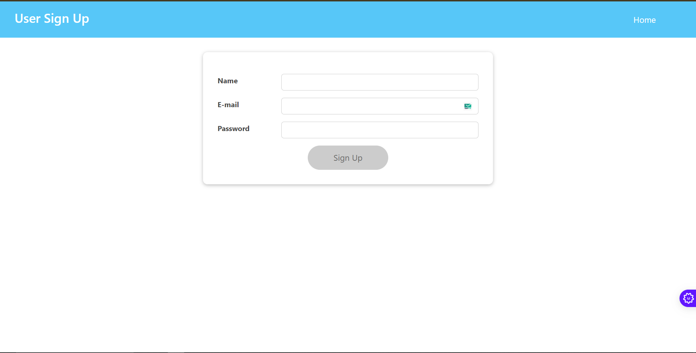

# 🛠️ User Management System

A full-stack **User Management System** built using the **MERN Stack**: **ReactJS** (frontend), **NodeJS** (backend), **ExpressJS** (web framework), and **MongoDB** (database). This project enables user account management with separate roles for **Admin** and **Users**. The system includes features such as user authentication, data management, and secure routing with **JWT** (JSON Web Tokens).

---

## 📑 Table of Contents

- [Project Overview](#project-overview)
- [✨ Features](#features)
  - [Admin](#admin)
  - [User](#user)
- [🛠️ Technologies Used](#technologies-used)
  - [🌟 MERN Stack](#mern-stack)
- [⚙️ Project Setup](#project-setup)
  - [Backend Setup](#backend-setup)
  - [Frontend Setup](#frontend-setup)
- [📊 API Endpoints](#api-endpoints)
- [🖼️ Screenshots](#screenshots)


---

## 📖 Project Overview

The **User Management System** consists of two main roles:

- **Admin**: Can manage users, view all users, edit user data, and delete accounts.
- **User**: Can sign up, log in, and upload a profile image. User-specific routes are protected by **JWT authentication**.

The admin and user functionalities are separated with role-based access control, ensuring only admins have access to certain features, such as viewing or deleting other users' data.

---

## ✨ Features

### 🛡️ Admin

- Protected routes using **JWT tokens**
- View all users in the system
- Search users by name or email
- Edit user details (name, email, password)
- Delete user accounts

### 🙍‍♂️ User

- **Sign up** with name, email, and password
- **Login** with email and password
- **Upload profile image**
- Protected routes using **JWT tokens**

---

## 🛠️ Technologies Used

### 🌟 MERN Stack

The **MERN** stack is a popular combination of powerful technologies used for building full-stack web applications. Each technology in the **MERN** stack has a critical role in the application:

- **MongoDB**: 🗄️ A NoSQL database for storing application data, like user credentials, profile details, and other related information. **MongoDB** stores data in JSON-like documents, providing flexibility and scalability for managing complex user information.

- **ExpressJS**: 🌐 A lightweight web framework for **Node.js**. It provides essential tools and features for building web applications, including routing and middleware for handling HTTP requests. **Express** helps build RESTful APIs and simplifies backend logic.

- **ReactJS**: 🎨 A popular JavaScript library used to build the frontend. **React** enables the creation of interactive user interfaces (UI) and efficient component-based development. In this project, **React** is responsible for rendering the admin and user views and managing client-side functionality.

- **NodeJS**: 🛠️ A runtime environment that allows the use of JavaScript on the server-side. **Node.js** is used to build the backend, handling API requests, connecting to the database, and managing user authentication.

---

## ⚙️ Project Setup

### Backend Setup

1. Clone the repository:
    ```bash
    git clone https://github.com/your-username/user-management-system.git
    cd user-management-system/backend
    ```

2. Install backend dependencies:
    ```bash
    npm install
    ```

3. Create a `.env` file in the `backend` folder and add your MongoDB URI and JWT secret:
    ```env
    MONGO_URI=your_mongo_db_uri
    JWT_SECRET=your_jwt_secret
    ```

4. Start the backend server:
    ```bash
    npm start
    ```

    The backend server will be running on [http://localhost:8000](http://localhost:8000).

### Frontend Setup

1. Navigate to the `frontend` directory:
    ```bash
    cd ../frontend
    ```

2. Install frontend dependencies:
    ```bash
    npm install
    ```

3. Start the frontend development server:
    ```bash
    npm start
    ```

    The frontend will be available at [http://localhost:3000](http://localhost:3000).

---

## 📊 API Endpoints

### User Endpoints

- **POST** `/user/signup` – Register a new user
- **POST** `/user/login` – Log in a user
- **GET** `/user/profile` – Get user profile (JWT protected)

### Admin Endpoints

- **GET** `/admin/users` – Get a list of all users (JWT protected)
- **PUT** `/admin/users/:id` – Edit a user's data (JWT protected)
- **DELETE** `/admin/users/:id` – Delete a user account (JWT protected)

---

## 🖼️ Screenshots

### Home


### Admin Login


*Admin can edit the details of a specific user.*


*Admin can Delete, Add And Edite  a user account from the system.*

### Admin Dashboard


*Admin can view all users and perform actions like search, edit, or delete.*

### User Sign-Up


### User Log-In


